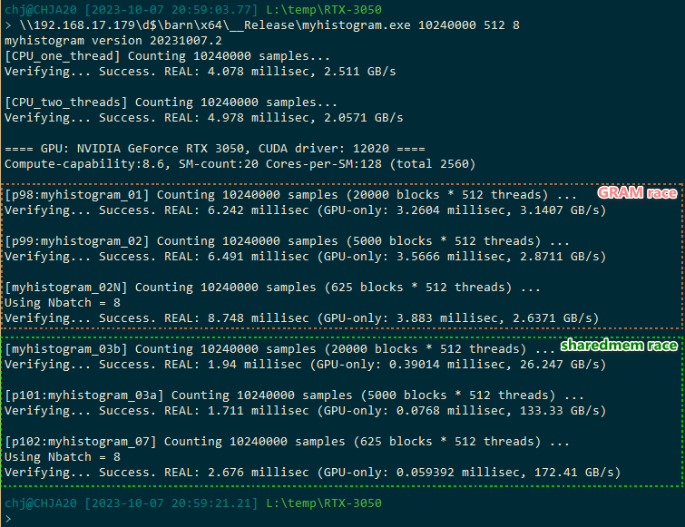

This program is adapted from sample code provided by chapter 5, page 97-103.

It demonstrates that, using GPU sharedmem as in-block write-cache, we avoid 
the bottleneck of "GPU core to GRAM bandwidth", so we get dramatic speed improvement.

The screenshot shows a sample run on RTX 3050:

The above executable is compiled with Visual Studio 2010 + CUDA SDK 8.0 .

-- Jimm Chen 2023.10.09
